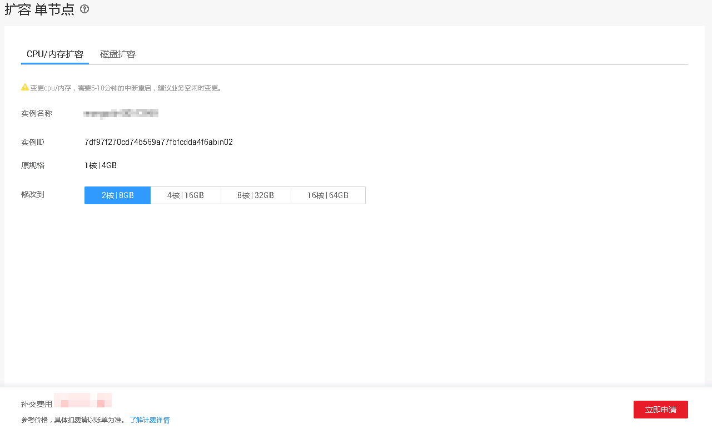

# 变更单节点实例的CPU和内存规格

当用户购买的单节点实例的CPU和内存规格无法满足业务需要时，可以在控制台进行CPU和内存规格变更。

## 操作场景

-   账户余额大于或等于0元，才可以变更规格。
-   当实例进行CPU和内存规格变更时，该实例不可被删除。
-   用户既可以扩大规格，也可以降低规格。
-   变更CPU和内存规格期间，业务不中断。

## 注意事项

-   对于按需计费的实例，变更规格后，依旧按使用时长实时计费。

-   对于包年/包月的实例，规格差价需补交或被退回。
    -   若变更后新规格的价钱高于旧规格，需结合已使用的时间周期，补交差价费用。
    -   若变更后新规格的价钱低于旧规格，需结合已使用的时间周期，退回差价费用。费用将退回至用户的账户，可在控制台右上角的“费用”处，查看账户余额。

## 操作步骤

1.  登录管理控制台。
2.  单击管理控制台左上角的，选择区域和项目。
3.  单击“服务列表”，选择“数据库“  \>  “文档数据库服务“，进入文档数据库服务信息页面。
4.  在“实例管理”页面，选择“单节点”页签，在目标实例的“操作”栏，单击“扩容“，进入“扩容单节点”页面。
5.  在“扩容单节点”页面，选择“CPU/内存扩容“页签，选择所需修改到的性能规格，单击“立即申请“。

    **图 1**  单节点CPU/内存扩容  
    

6.  在“规格确认“页面，进行规格确认。
    -   如需重新选择，单击“上一步“，回到“服务选型“页面，修改新增磁盘容量大小。
    -   对于按需计费的实例，如果确认无误，单击“提交申请”，提交变更。
    -   对于“包年/包月”的实例，如果没有问题，单击“去支付”，进入“付款”页面，选择支付方式，完成支付。

7.  查看变更结果。
    -   CPU和内存变更过程中，实例运行状态显示为“规格变更中”，此过程约10分钟。
    -   在实例列表的右上角，单击刷新列表，可看到规格变更完成的实例的运行状态显示为“正常”。
    -   在单节点实例“基本信息”页面的“配置”区域，可查看变更后的实例规格。

