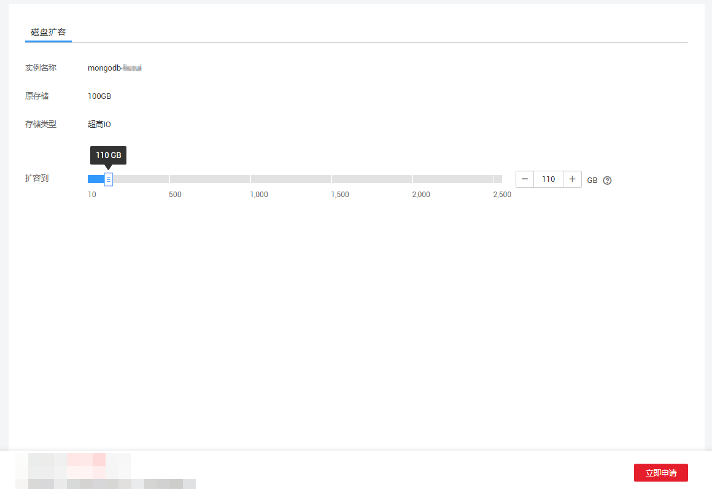

# 扩容存储（社区增强版）

## 操作场景

随着业务数据的增加，原来申请的数据库存储容量不能满足需求。这时，您需要为实例进行存储扩容。

> **说明：**   
>-   故障的实例不可扩容。  
>-   创建中、分片扩容中、分片缩容中的实例不可扩容。  
>-   存储容量变更只允许扩容，不能缩容。  

## 操作步骤

1.  登录管理控制台。
2.  单击管理控制台左上角的，选择区域和项目。
3.  单击“服务列表”，选择“数据库“  \>  “文档数据库服务“，进入文档数据库服务信息页面。
4.  在“实例管理”页面，选择“集群“页签，单击目标实例的名称。
5.  在“基本信息”页面的“存储”区域，单击“存储空间使用情况”后的“扩容“，进入“扩容集群存储”页面。
6.  在“扩容集群存储”页面，选择所需扩容到的磁盘容量，单击“立即申请“。

    **图 1**  扩容集群存储  
    

    用户每次至少选择10GB扩容量，且必须为10的整数倍，扩容的最大限制由分片规格和数量来决定，请参见[购买实例（社区增强版）](https://support.huaweicloud.com/qs-dds/dds_02_0034.html)中“存储空间上限”的说明。

7.  在“规格确认“页面，进行规格确认。
    -   如需重新选择，单击“上一步“，回到“服务选型“页面，修改新增磁盘容量大小。
    -   如果确认无误，单击“提交申请“，提交任务。

8.  检查存储扩容结果。
    -   存储扩容过程中，实例运行状态显示为“存储扩容中”，此过程约3～5分钟。
    -   在实例列表的右上角，单击刷新列表，可看到存储扩容完成的实例的运行状态显示为“正常”。
    -   在集群实例“基本信息”页面的“存储”区域，可查看扩容后的磁盘容量。

