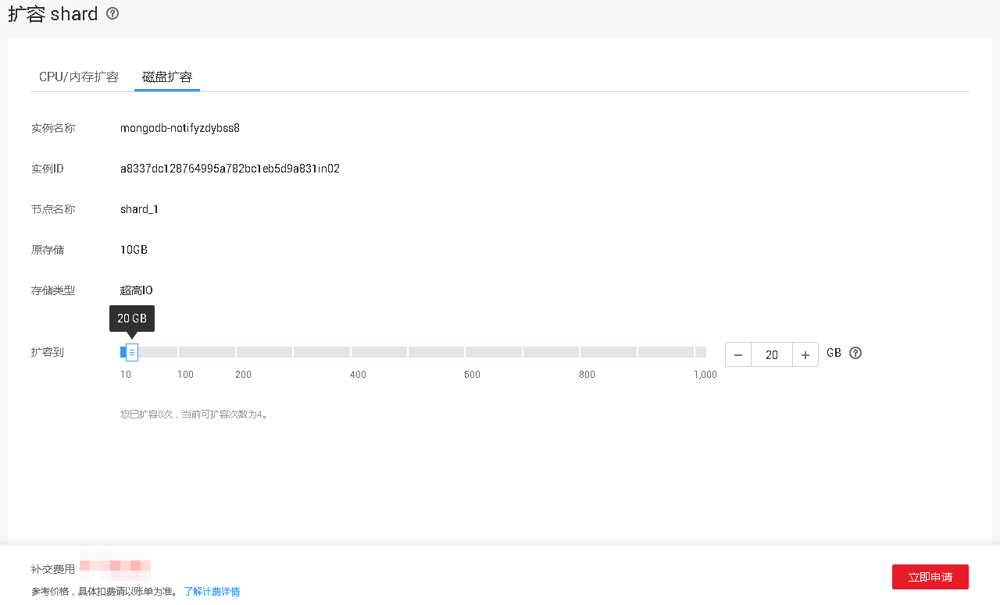
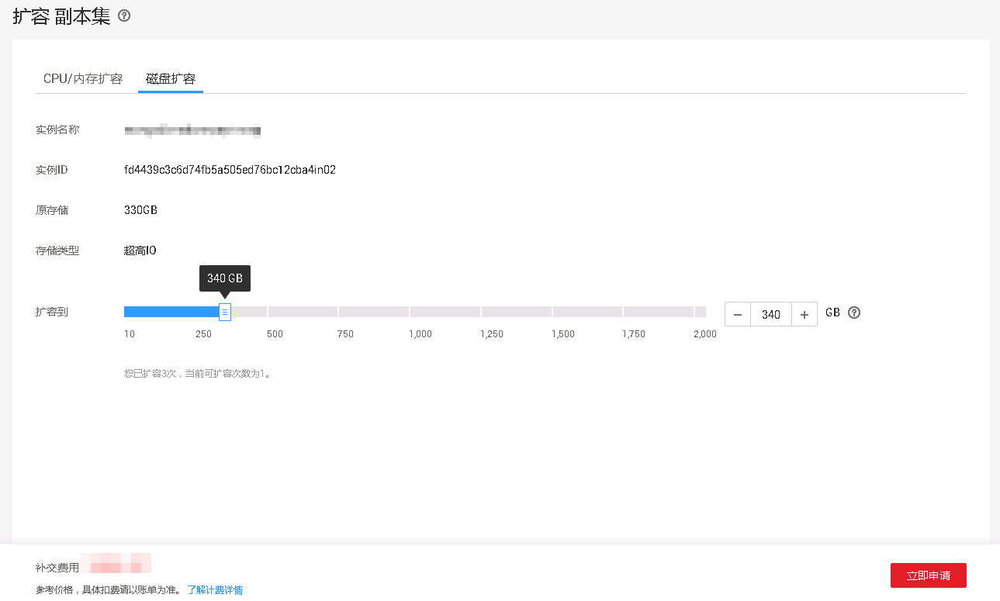
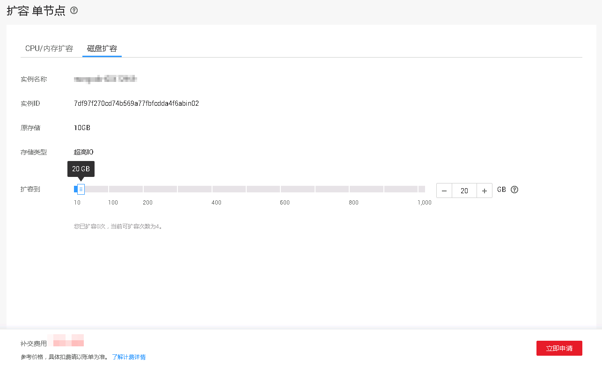

# 扩容存储（社区版）

## 操作场景

随着业务数据的增加，原来申请的数据库存储容量不能满足需求。这时，您需要为实例进行存储扩容。

> **说明：**   
>-   每个实例最多只能扩容四次。  
>-   故障的实例不可扩容。  
>-   创建中、规格变更中、节点扩容中、删除节点中的实例不可扩容。  
>-   存储容量变更只允许扩容，不能缩容。  
>-   选择磁盘加密的实例，新扩容的磁盘空间依然会使用原加密密钥进行加密。  
>-   对于高可用类型为集群的实例，config节点不能进行磁盘扩容。  

## 集群

1.  登录管理控制台。
2.  单击管理控制台左上角的，选择区域和项目。
3.  单击“服务列表”，选择“数据库“  \>  “文档数据库服务“，进入文档数据库服务信息页面。
4.  在“实例管理”页面，选择“集群“页签，单击目标实例的名称。
5.  在“基本信息“页面的“节点信息“区域，选择“shard“页签，在shard节点的“操作”栏，单击“扩容”，进入“扩容shard”页面。
6.  在“扩容shard”页面，选择“磁盘扩容”页签，选择所需扩容磁盘空间大小，单击“立即申请“。

    **图 1**  shard磁盘扩容  
    

    用户每次至少选择10GB扩容量，且必须为10的整数倍，扩容的最大限制为1000GB。

7.  在“规格确认“页面，进行规格确认。
    -   如需重新选择，单击“上一步“，回到“服务选型“页面，修改新增磁盘容量大小。
    -   对于按需计费的实例，如果确认无误，单击“提交申请“，提交任务。
    -   对于“包年/包月”的实例，如果没有问题，单击“去支付”，进入“付款”页面，选择支付方式，完成支付。

8.  检查存储扩容结果。
    -   存储扩容过程中，实例运行状态显示为“存储扩容中”，此过程约3～5分钟。
    -   在实例列表的右上角，单击刷新列表，可看到存储扩容完成的实例的运行状态显示为“正常”。
    -   在集群实例“基本信息”页面的“节点信息“区域，选择“shard“页签，在shard节点的“存储空间使用情况”栏，可查看扩容后的磁盘容量。

## 副本集

1.  登录管理控制台。
2.  单击管理控制台左上角的，选择区域和项目。
3.  单击“服务列表”，选择“数据库“  \>  “文档数据库服务“，进入文档数据库服务信息页面。
4.  在“实例管理”页面，选择“副本集”页签，在目标实例的“操作”栏，单击“扩容“，进入“扩容副本集”页面。
5.  在“扩容副本集”页面，选择“磁盘扩容”页签，选择所需扩容磁盘空间大小，单击“立即申请“。

    **图 2**  副本集磁盘扩容  
    

    用户每次至少选择10GB扩容量，且必须为10的整数倍，最大扩容到的磁盘容量为2000GB。

6.  在“规格确认“页面，进行规格确认。
    -   如需重新选择，单击“上一步“，回到“服务选型“页面，修改新增磁盘容量大小。
    -   对于按需计费的实例，如果确认无误，单击“提交申请“，提交任务。
    -   对于“包年/包月”的实例，如果没有问题，单击“去支付”，进入“付款”页面，选择支付方式，完成支付。

7.  检查存储扩容结果。
    -   存储扩容过程中，实例运行状态显示为“存储扩容中”，此过程约3～5分钟。
    -   在实例列表的右上角，单击刷新列表，可看到存储扩容完成的实例的运行状态显示为“正常”。
    -   在副本集实例“基本信息”页面的“存储空间”区域，可查看扩容后的磁盘容量。

## 单节点

1.  登录管理控制台。
2.  单击管理控制台左上角的，选择区域和项目。
3.  单击“服务列表”，选择“数据库“  \>  “文档数据库服务“，进入文档数据库服务信息页面。
4.  在“实例管理”页面，选择“单节点”页签，在目标实例的“操作”栏，单击“扩容“，进入“扩容单节点”页面。
5.  在“扩容单节点”页面，选择“磁盘扩容”页签，选择所需扩容磁盘空间大小，单击“立即申请“。

    **图 3**  单节点磁盘扩容  
    

    用户每次至少选择10GB扩容量，且必须为10的整数倍，最大扩容到的磁盘容量为1000GB。

6.  在“规格确认“页面，进行规格确认。
    -   如需重新选择，单击“上一步“，回到“服务选型“页面，修改新增磁盘容量大小。
    -   对于按需计费的实例，如果确认无误，单击“提交申请“，提交任务。
    -   对于“包年/包月”的实例，如果没有问题，单击“去支付”，进入“付款”页面，选择支付方式，完成支付。

7.  检查存储扩容结果。
    -   存储扩容过程中，实例运行状态显示为“存储扩容中”，此过程约3～5分钟。
    -   在实例列表的右上角，单击刷新列表，可看到存储扩容完成的实例的运行状态显示为“正常”。
    -   在单节点实例“基本信息”页面的“存储空间”区域，可查看扩容后的磁盘容量。

