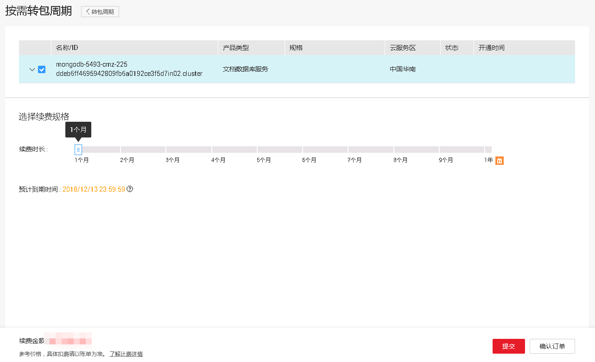

# 按需计费实例转包周期

## 操作场景

文档数据库服务支持将按需计费实例转为包周期（包年/包月）实例。由于按需资源较贵，需要长期使用资源的按需用户可以选择对按需资源进行转包周期，继续使用这些资源的同时，享受包周期的低资费。

> **说明：**   
>按需计费实例状态为“正常”时才能转包周期。  

## 多个按需计费实例批量转包周期

1.  登录管理控制台。
2.  单击管理控制台左上角的，选择区域和项目。
3.  单击“服务列表”，选择“数据库“  \>  “文档数据库服务“，进入文档数据库服务信息页面。
4.  在“实例管理”页面，分别在“集群”、“副本集”、或“单节点”页签下，勾选目标实例，在实例列表上方单击“批量转包周期”，在弹出框中单击“是”，进入“按需转包周期”页面。
5.  在“按需转包周期”页面，选择续费规格，以月为单位，最小包周期时长为一个月。
    -   如果订单确认无误，单击“提交”，进入“支付”页面。
    -   如果暂不确定续费规格，单击“确认订单”，系统将保留您的订单，稍后可在“费用 \> 我的订单”中支付或取消订单。

6.  选择支付方式，单击“确认付款“。
7.  按需转包周期创建成功后，用户可以在“实例管理“页面对其进行查看和管理。

    在实例列表的右上角，单击刷新列表，可查看到按需转包周期完成后，实例状态显示为“正常“。“计费方式”显示为“包年/包月“

## 单个按需计费实例转包周期

1.  登录管理控制台。
2.  单击管理控制台左上角的，选择区域和项目。
3.  单击“服务列表”，选择“数据库“  \>  “文档数据库服务“，进入文档数据库服务信息页面。
4.  在“实例管理”页面，分别在“集群”、“副本集”、或“单节点”页签下，选择目标实例，单击“转包周期“，进入“按需转包周期”页面。
5.  在“按需转包周期”页面，选择续费规格，以月为单位，最小包周期时长为一个月。如[图1](#fig61532493719)所示，以集群实例按需转包周期为例。

    **图 1**  集群实例按需转包周期  
    

    -   如果订单确认无误，单击“提交”，进入“支付”页面。
    -   如果暂不确定续费规格，单击“确认订单”，系统将保留您的订单，稍后可在“费用 \> 我的订单”中支付或取消订单。

6.  选择支付方式，单击“确认付款“。
7.  按需转包周期创建成功后，用户可以在“实例管理“页面对其进行查看和管理。

    在实例列表的右上角，单击刷新列表，可查看到按需转包周期完成后，实例状态显示为“正常“。“计费方式”显示为“包年/包月“

