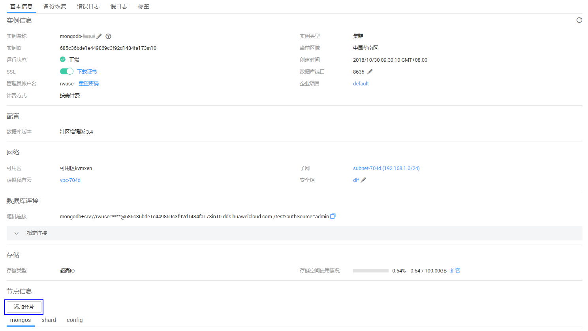
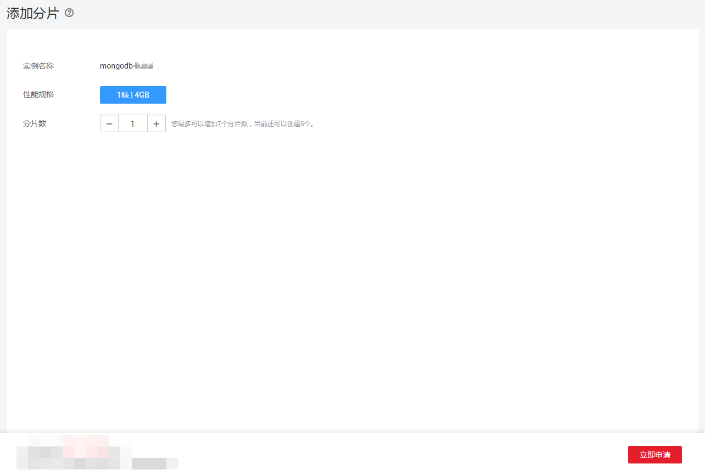

# 添加集群实例的分片（社区增强版）

## 操作场景

随着业务数据的增加，原来申请的数据库分片数量不能满足需求。这时您需要对实例进行新增分片。

> **说明：**   
>-   实例状态为正常、删除备份中和恢复检查中时可以添加分片。  
>-   实例进行添加分片时，该实例不可被删除。  

## 添加分片

1.  登录管理控制台。
2.  单击管理控制台左上角的，选择区域和项目。
3.  单击“服务列表”，选择“数据库“  \>  “文档数据库服务“，进入文档数据库服务信息页面。
4.  在“实例管理”页面，选择“集群“页签，单击目标社区增强版实例的名称。
5.  在“基本信息“页面的“节点信息”区域，单击“添加分片”。

    **图 1**  社区增强版实例基本信息  
    

6.  在“添加分片”页面，选择新增分片数量，单击“立即申请“。

    **图 2**  添加分片  
    

    分片最多可以增加到12个。

7.  在“规格确认”页面，进行规格确认。
    -   如需重新选择，单击“上一步“，回到“服务选型“页面，修改相关配置。
    -   如果确认无误，单击“提交申请“，提交任务。

8.  查看添加分片结果。
    -   添加分片过程中，实例运行状态显示为“分片扩容中”，此过程约10～15分钟。
    -   在实例列表的右上角，单击刷新列表，可看到添加分片完成的实例的运行状态显示为“正常”。
    -   在实例“基本信息”页面的“分片信息”区域，可查看新增分片信息。
    -   若添加分片失败，可进行回退，详见[回退集群实例的分片（社区增强版）](回退集群实例的分片（社区增强版）.md)。

